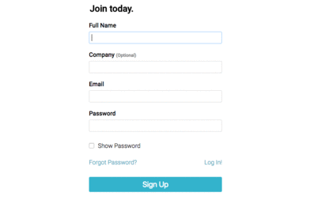

# Signup, Login, and Password recovery forms

Just as the title suggests. Forms and workflows for user account creation, authentication, and password recovery using vanilla javascript, vanilla CSS, and handlebars templating.

### Views
<p align="center">
  
</p>

## Installation

1. Install node.js.
2. `git clone` the repo and run `npm install`.
3. Create file `nodemailerConfig.json` in `<userHomeDir>/.config/` with the following contents:

```javascript
{
  "service": <email service e.g. 'gmail'>,
  "user": <email account>,
  "pass": <password of the email account>,
  "name": <name of email sender>
}
```

Please refer to the [nodemailer config](https://nodemailer.com/smtp/) for more information.

## License

MIT
